imported slide
---
src: ../shared/me.md
---
imported slide
---
layout: center
class: text-center
---

# What is the microfrontends architecture?
<br>

<div >
    
## ❝ An architectural style where <br>  independently deliverable <span v-mark.strike.white="[1]" v-click.hide="2">frontend applications</span><span v-click.show="2" v-mark.circle.white="2">services</span><br> are composed into a greater whole. ❞ <br>
### ~ Martin Fowler
</div>

---
layout: center
class: text-center
---

### Basically it's
## Microservices, but for Frontend

---
title: Microservices vs Microfrontends
layout: two-cols
---

# Microservices

<br>
<v-click>

- One purpose service
</v-click>
<v-click at="3">

- Own database
</v-click>
<v-click at="5">

- Own deployment pipeline
</v-click>
<v-click at="7">

 - Own server / container
 </v-click>
<v-click at="9">

 - API contracts (OpenAPI) 
</v-click>
<v-click at="11">

 - Runtime invocation
 </v-click>

<v-click at="13">

 - Sync/Async comms (rest/event)
 </v-click>

::right::

# Microfrontends

<br>
<v-click at="2">

 - One application/feature/component
</v-click>
<v-click at="4">

 - Own api
</v-click>
<v-click at="6">

 - Own deployment pipeline
</v-click>
<v-click at="8">

 - Own server / container
</v-click>
<v-click at="10">

 - Component contracts (TypeScript) 
</v-click>
<v-click at="12">

 - Runtime import
</v-click>

<v-click at="14">

 - Async comms (event doms)
 </v-click>

---
layout: center
class: text-center
---

<div class="text-xl">
<div>

## Remember the microservices hype?
</div>

<div v-click class="mt-8">

### And then the "microservices are bad" backlash?
</div>

<div v-click class="mt-12 text-2xl">

# The same applies to microfrontends
</div>

<div v-click class="mt-8 text-green-400">

## You need the **right tool** for the **right context**
</div>
</div>

---
layout: center
class: text-center
---

# When should you consider microfrontends?

<!-- Okay so, also based on the lessons we learned at Post, let's see when I can recommend it or when instead I would probably push you off of the idea to implement it -->

---
layout: center
class: text-center
---

# Key factors to take in consideration

<div class="flex flex-row gap-8 mt-16">
<div v-click class="flex-1">

  ### Teams
  #### independent teams
  ⚠️
</div>
<div v-click class="flex-1">

  ### Modules 
  #### clear domain boundaries
  ✅
</div>
<div v-click class="flex-1">

  ### Releases
  #### independent deployments
  ✅
</div>
<div v-click class="flex-1">

  ### Reusability
  #### shared components
  ✅
</div>
<div v-click class="flex-1">

  ### Technology
  #### flexibility
  ✅
</div>
<div v-click class="flex-1">

  ### Scalability 
  #### performance
  ❌
</div>
</div>


<!-- 
[click] Teams: how many teams will work on the frontend and how they are scoped 
[click] Modules: how many modules (applications, features or components) 
[click] Releases: how will the modules be released
[click] Reusability: how will the modules be reused across applications
 -->


---
hide: true
layout: center
class: text-center
---

# How many teams will be working on the frontend?

<div class="flex flex-row gap-8 mt-16">

<div class="flex-1">
  <div v-click>

  # One team
  </div>
  <div v-click class="text-red-400">
  Probably not worth
  </div>
</div>


<div class="flex-1">
  <div v-click>

  # More than one team
  </div>
  <div v-click class="text-amber-400">

  Well, it depends™️
  </div>
</div>

</div>


---
hide: true
layout: center
class: text-center
---

# How do you expect teams working on the modules?

<div class="flex flex-row gap-6 mt-16">


<div class="flex-1">
  <div v-click>

  # One team <br> per module
  </div>
  <div v-click class="text-green-400">
  Probably worth
  </div>
</div>

<div class="flex-1">
  <div v-click>

  # One team <br> on many modules
  </div>
  <div v-click class="text-red-400">
  Probably not worth
  </div>
</div>

</div>


---
hide: true
layout: center
class: text-center
---

# How do you expect to release your modules?

<div class="flex flex-row gap-8 mt-16">

<div class="flex-1">
  <div v-click>

  # All together
  </div>
  <div v-click class="text-red-400">
  Not worth
  </div>
</div>


<div class="flex-1">
  <div v-click>

  # Independently
  </div>
  <div v-click class="text-green-400">

  Probably worth
  </div>
</div>

</div>


---
hide: true
layout: center
class: text-center
---

# Do you need your modules to be shared across applications?

<div class="flex flex-row gap-8 mt-16">

<div class="flex-1">
  <div v-click>

  # No
  </div>
  <div v-click class="text-red-400">

  Probably not worth
  </div>
</div>

<div class="flex-1">
  <div v-click>

  # Yes
  </div>
  <div v-click class="text-amber-400">

  Well, it depends™️
  </div>
</div>

</div>

---
layout: center
class: text-center
---

# Shell Responsibilities

<div class="flex flex-row gap-8 mt-16">
<div v-click class="flex-1">

  ### Routing
  #### Managing navigation between microfrontends
</div>
<div v-click class="flex-1">

  ### Composition 
  #### Loading and orchestrating multiple MFs
</div>
<div v-click class="flex-1">

  ### Authentication
  #### Handling user auth and session management
</div>
<div v-click class="flex-1">

  ### Shared Context
  #### providing common state and services
</div>
</div>

---
layout: center
---

# Cartella Clinica Architecture

```mermaid
graph TB
    NPM[("NPM Registry<br/>📦")]

    subgraph "Module Servers (run-time)"
        UI["@epd/module/ui<br/>(Lit)<br/>🏝️ Server 1"]
        FHIR["@epd/module/fhir<br/>(React)<br/>🏝️ Server 2"]
    end

    subgraph "Shell Servers (run-time)"
        PATIENT["@epd/shell/patient<br/>(React)<br/>🏝️ Server 3"]
        PRACTITIONER["@epd/shell/practitioner<br/>(React)<br/>🏝️ Server 4"]
        ADMINS["@epd/shell/admins<br/>(React)<br/>🏝️ Server 5"]
    end

    NPM -.->|"compile-time<br/>@epd/shared/auth"| PATIENT
    NPM -.->|"compile-time<br/>@epd/shared/auth"| PRACTITIONER
    NPM -.->|"compile-time<br/>@epd/shared/auth"| ADMINS
    NPM -.->|"compile-time<br/>types & skeletons"| PATIENT
    NPM -.->|"compile-time<br/>types & skeletons"| PRACTITIONER
    NPM -.->|"compile-time<br/>types & skeletons"| ADMINS

    UI ==>|"run-time<br/>remote module"| PATIENT
    UI ==>|"run-time<br/>remote module"| PRACTITIONER
    UI ==>|"run-time<br/>remote module"| ADMINS
    FHIR ==>|"run-time<br/>remote module"| PATIENT
    FHIR ==>|"run-time<br/>remote module"| PRACTITIONER
    FHIR ==>|"run-time<br/>remote module"| ADMINS

    classDef npmStyle fill:#f9f,stroke:#333,stroke-width:2px
    classDef moduleStyle fill:#bbf,stroke:#333,stroke-width:2px
    classDef shellStyle fill:#bfb,stroke:#333,stroke-width:2px

    class NPM npmStyle
    class UI,FHIR moduleStyle
    class PATIENT,PRACTITIONER,ADMINS shellStyle
```



---
layout: default
---

# 3 Ways of Importing React Components

<v-clicks>

## 1. ESM Import
```tsx
import { Component } from './component'
```
- Blocks render until loaded
- No skeleton/spinner capability

## 2. React.lazy + Suspense
```tsx
const Component = lazy(() => import('./component'))
<Suspense fallback={<Skeleton />}><Component /></Suspense>
```
- ESM import with loading state
- Built-in skeleton support

## 3. Module Federation Runtime
```tsx
const [Component, setComponent] = useState(null)
useEffect(() => { loadRemote('app/Component').then(setComponent) }, [])
```
- Dynamic remote loading
- Custom skeleton component control

</v-clicks>

---
layout: center
class: text-center
---

# disclaimer: how do we effectively do microfrontends

<div class="flex flex-col gap-4 mt-12 text-left text-lg">
    
<ul>
<li v-click="1"><span v-mark.strike.white="6"><strong>iframes</strong> - Isolated contexts</span></li>
<li v-click="2"><span v-mark.strike.white="7"><strong>web components</strong> - Custom elements</span></li>
<li v-click="3"><span v-mark.strike.white="8"><strong>SPAs</strong> - Runtime loading</span></li>
<li v-click="4"><span v-mark.circle.white="9"><strong>Module Federation / Import maps</strong> - Dynamic imports</span></li>
</ul>
</div>

<div v-click="5" class="mt-4 text-xl text-green-400">

**Key:** Runtime invocation ensures independent deployability
</div>

<!-- we are gonna focus on the modern approaches -->

---
layout: center
class: text-center
---

# The hidden costs of microfrontends

<div class="flex flex-row flex-wrap gap-6 mt-16">

<div class="flex-1">
  <div v-click>

  ## Performance
  #### duplicate dependencies
  </div>
</div>

<div class="flex-1">
  <div v-click>

  ## Complexity
  #### distributed debugging
  </div>
</div>

<div class="flex-1">
  <div v-click>

  ## Governance
  #### inconsistent UX
  </div>
</div>

<div class="flex-1">
  <div v-click>

  ## Overhead
  #### coordination burden
  </div>
</div>
    
<div class="flex-1">
  <div v-click>

  ## Deployment
  #### duplicate ci&cd
  </div>
</div>
    
<div class="flex-1">
  <div v-click>

  #### .. and more
  ### *ai wont tell you*
  </div>
</div>

</div>

<!-- mention that performance is main goal of module federation -->
<!-- mention that debugging is still one of our biggest problems -->

---
layout: center
class: text-center 
---

## Problem 1: how do we ensure type safety?

<div class="flex flex-col gap-2 text-left">

<div v-click>
        
### Problem
Runtime imports = No compile-time type checking
</div>

<div v-click>

### Solution
**Dual-mode approach:**
- **Runtime**: Load ESM bundles from remote server (Module Federation)
- **Compile-time**: Install npm package with **only `.d.ts` files**
</div>

<div v-click class="text-green-400">

### Benefits
        
✓ Type checking during development
        
✓ IDE autocomplete and IntelliSense
        
✓ Independent runtime deployments
</div>

</div>

<!-- if we have runtime imports, it means we dont have typescript at compile time -->

---
layout: image
image: /assets/demo-time.jpg
---

---
layout: center
class: text-center 
---

## Problem 2: what if components are slow to load?

<div class="flex flex-col gap-2 text-left">

<div v-click>
        
### Problem
Runtime imports = No compile-time type checking
</div>

<div v-click>

### Solution
**Dual-mode approach:**
- **Runtime**: Load ESM bundles from remote server (Module Federation)
- **Compile-time**: Install npm package with **only `.d.ts` files**
</div>

<div v-click class="text-green-400">

### Benefits
        
✓ Type checking during development
        
✓ IDE autocomplete and IntelliSense
        
✓ Independent runtime deployments
</div>

</div>

<!-- if we have runtime imports, it means we dont have typescript at compile time -->

---
layout: image
image: /assets/demo-time.jpg
---

---
layout: center
class: text-center 
---

## Problem 3: who owns the skeleton?


<div class="flex flex-col gap-2 text-left">

<div v-click>
        
### Problem
Runtime imports = No compile-time type checking
</div>

<div v-click>

### Solution
**Dual-mode approach:**
- **Runtime**: Load ESM bundles from remote server (Module Federation)
- **Compile-time**: Install npm package with **only `.d.ts` files**
</div>

<div v-click class="text-green-400">

### Benefits
        
✓ Type checking during development
        
✓ IDE autocomplete and IntelliSense
        
✓ Independent runtime deployments
</div>

</div>

<!-- show demo of double skeleton issue -->

---
layout: image
image: /assets/demo-time.jpg
---

---
layout: two-cols
---

# Module Federation

<div class="text-sm">

**Webpack 5+ feature** for runtime code sharing

### Key Concepts

- **Host**: App consuming remote modules
- **Remote**: App exposing modules
- **Shared dependencies**: De-duplicated at runtime

### Benefits

✅ Runtime integration (no build-time coupling)<br>
✅ Independent deployments<br>
✅ Shared dependencies optimization<br>
✅ Version management built-in

</div>

::

<div class="text-sm mt-8">

### How it works


<div class="mt-4 opacity-80">
Remotes expose modules via manifest<br>
Hosts consume them asynchronously<br>
Shared deps loaded once
</div>

</div>

---

# Module Federation - Configuration

<div class="grid grid-cols-2 gap-4">

<div>

### Remote App (Product Catalog)

```js {all|3-7|8-12|all}
// webpack.config.js
new ModuleFederationPlugin({
  name: 'productCatalog',
  filename: 'remoteEntry.js',
  exposes: {
    './ProductList': './src/ProductList',
  },
  shared: {
    react: { singleton: true },
    'react-dom': { singleton: true },
  },
})
```

</div>

<div>

### Host App (Main Shell)

```js {all|3-6|7-11|all}
// webpack.config.js
new ModuleFederationPlugin({
  name: 'shell',
  remotes: {
    productCatalog: 'productCatalog@http://localhost:3001/remoteEntry.js',
  },
  shared: {
    react: { singleton: true },
    'react-dom': { singleton: true },
  },
})
```

</div>

</div>

---

# Module Federation - Usage

<div class="grid grid-cols-2 gap-4">

<div>

### Lazy Loading Remote

```tsx {all|2|5-6|all}
// App.tsx
const ProductList = lazy(() => import('productCatalog/ProductList'));

function App() {
  return (
    <Suspense fallback={<Loading />}>
      <ProductList />
    </Suspense>
  )
}
```

<div class="mt-4 text-sm opacity-80">

✨ Loaded at runtime<br>
✨ Type-safe with proper setup<br>
✨ Error boundaries recommended

</div>

</div>

<div>

### Dynamic Remotes

```tsx {all|2-5|7-11|all}
// Load remote dynamically
const loadRemote = (url: string) => {
  return import(/* webpackIgnore: true */ url)
    .then(module => module.default)
}

// Usage
loadRemote('http://cdn.example.com/remote.js')
  .then(Component => {
    // Render component
  })
```

<div class="mt-4 text-sm opacity-80">

⚡ Runtime flexibility<br>
⚡ A/B testing friendly<br>
⚡ Multi-tenant scenarios

</div>

</div>

</div>

---
layout: two-cols
---

# Import Maps

<div class="text-sm">

**Browser-native** module resolution

### Key Concepts

- **No bundler required**
- **Native ES modules**
- **URL mapping for imports**
- **Runtime dependency resolution**

### Benefits

✅ Simple and standard<br>
✅ No build tool dependency<br>
✅ CDN-friendly<br>
✅ Works with any framework

</div>

::

<div class="text-sm mt-8">

### How it works

```html
<script type="importmap">
{
  "imports": {
    "react": "https://esm.sh/react@18",
    "app/": "/src/"
  }
}
</script>
```

<div class="mt-4 opacity-80">
Browser resolves bare imports<br>
Maps to actual URLs<br>
Native module loading
</div>

</div>

---

# Import Maps - Example

<div class="grid grid-cols-2 gap-4">

<div>

### HTML Setup

```html {all|2-10|12-14|all}
<!-- index.html -->
<script type="importmap">
{
  "imports": {
    "react": "https://esm.sh/react@18.2.0",
    "react-dom": "https://esm.sh/react-dom@18.2.0",
    "components/": "./components/"
  }
}
</script>

<script type="module">
  import { render } from 'react-dom';
  import App from 'components/App.js';

  render(<App />, document.getElementById('root'));
</script>
```

</div>

<div>

### Module Code

```js
// components/App.js
import React from 'react';
import { ProductList } from 'components/ProductList.js';

export default function App() {
  return (
    <div>
      <h1>My App</h1>
      <ProductList />
    </div>
  )
}
```

<div class="mt-4 text-sm opacity-80">

✨ No bundler needed<br>
✨ Works directly in browser<br>
✨ Standard ES modules

</div>

</div>

</div>

---

# Import Maps - Advanced Usage

<div class="grid grid-cols-2 gap-4">

<div>

### Scoped Imports

```json {all|4-9|all}
{
  "imports": {
    "lodash": "https://esm.sh/lodash@4.17.21"
  },
  "scopes": {
    "/admin/": {
      "lodash": "https://esm.sh/lodash@4.17.20"
    }
  }
}
```

<div class="mt-4 text-sm opacity-80">
Different versions per path<br>
Useful for migrations
</div>

</div>

<div>

### Integrity & Preloading

```html
<!-- Preload for performance -->
<link rel="modulepreload"
      href="https://esm.sh/react@18.2.0" />

<!-- With integrity check -->
<script type="importmap">
{
  "imports": {
    "react": "https://esm.sh/react@18.2.0"
  },
  "integrity": {
    "https://esm.sh/react@18.2.0": "sha384-xxx"
  }
}
</script>
```

</div>

</div>

---

# Module Federation vs Import Maps

<div class="text-sm">

| Feature | Module Federation | Import Maps |
|---------|------------------|-------------|
| **Build Tool** | Webpack 5+ required | None (browser native) |
| **Complexity** | Higher learning curve | Simple, straightforward |
| **Dependency Sharing** | Advanced (versions, singletons) | Basic (URL mapping) |
| **Bundle Optimization** | Built-in optimization | Manual via CDN |
| **Browser Support** | All (transpiled) | Modern browsers only |
| **TypeScript** | Good support with setup | Requires build step for types |
| **Runtime Loading** | Async chunks, optimized | Native ES modules |
| **Team Independence** | High (separate builds) | High (separate deployments) |
| **Versioning** | Semver aware | URL-based |
| **Fallbacks** | Built-in strategies | Manual implementation |

</div>

---

# When to Use What?

<div class="grid grid-cols-2 gap-8">

<div>

## Module Federation

### ✅ Use when:

- Using Webpack already
- Need sophisticated dependency sharing
- Complex version requirements
- Want optimized bundles
- Large teams with separate apps
- Need SSR support

### ❌ Avoid when:

- Want simplicity over features
- No build step desired
- Small projects
- Webpack not an option

</div>

<div>

## Import Maps

### ✅ Use when:

- Want browser-native solution
- No bundler preference
- Simple dependency needs
- Using CDN for everything
- Modern browsers only OK
- Rapid prototyping

### ❌ Avoid when:

- Need IE11 support
- Complex dependency graphs
- Want bundle optimization
- Need SSR

</div>

</div>

---

# Module Federation + Vite: The Confusion

<div class="text-sm">

### The Problem: Webpack-only Feature

Module Federation was built **for Webpack 5+** → Vite users had no official solution

### The Solutions (Past & Present)

<div class="grid grid-cols-3 gap-4 mt-4">

<div class="border border-gray-600 rounded p-4">

#### @originjs/vite-plugin-federation

**Community Plugin** (2021)

✅ First Vite MF solution<br>
✅ Popular & battle-tested<br>
🔶 Module Federation 1 only<br>
❌ Not officially maintained<br>
❌ MF2 support uncertain

```bash
npm i @originjs/vite-plugin-federation
```

</div>

<div class="border border-gray-600 rounded p-4">

#### @module-federation/vite

**Official Plugin** (2023)

✅ From MF team<br>
✅ Better Vite integration<br>
🔶 Module Federation 1 only<br>
❌ MF2 not ready yet<br>
⚠️ Still maturing

```bash
npm i @module-federation/vite
```

</div>

<div class="border border-green-600 rounded p-4 bg-green-900/10">

#### Rolldown + Vite

**Future Built-in** (TBD)

🚀 Rust-based bundler<br>
🚀 Will replace Rollup in Vite<br>
🚀 Native MF2 support planned<br>
✨ No plugin needed<br>
⏳ Under development

</div>

</div>

</div>

---

# Module Federation Versions Timeline

<div class="text-sm">


</div>

---

# What Should You Use Today?

<div class="grid grid-cols-2 gap-8">

<div>

## For Webpack Projects

### ✅ Built-in Module Federation

```js
// webpack.config.js
new ModuleFederationPlugin({
  // MF1 stable, MF2 available
})
```

**Status:** ✅ Production ready<br>
**MF Version:** 1.0 stable, 2.0 available<br>
**Recommendation:** Use it!

</div>

<div>

## For Vite Projects

### 🤔 Choose Your Adventure

**Option A: @originjs/vite-plugin-federation**
- More mature, community battle-tested
- MF1 only, uncertain MF2 future

**Option B: @module-federation/vite**
- Official plugin, better support path
- Still maturing, MF1 only for now

**Option C: Wait for Rolldown**
- Native MF2 support
- No plugin needed
- ⏳ Timeline uncertain

### 💡 Recommendation
Use **@module-federation/vite** if you need it now, or **wait for Rolldown** if you can.

</div>

</div>

---

# The Key Differences: MF1 vs MF2

<div class="text-sm">

| Feature | Module Federation 1 | Module Federation 2 |
|---------|-------------------|-------------------|
| **Runtime** | Container-based | Enhanced runtime with better error handling |
| **Developer Experience** | Basic tooling | Improved DX, better TypeScript support |
| **Performance** | Good | Optimized loading strategies |
| **Build Tools** | Webpack 5 | Webpack 5, Rspack, (Rolldown planned) |
| **Type Safety** | Manual setup | Better native support |
| **Debugging** | Challenging | Improved error messages & dev tools |
| **Vite Support** | Via plugins | Native (when Rolldown lands) |

</div>

<div class="mt-4 p-4 bg-yellow-900/20 border border-yellow-600 rounded">

### ⚠️ Bottom Line

**Webpack users:** MF is ready (use MF2)<br>
**Vite users:** Use plugins (MF1) now, or wait for Rolldown (MF2 native)<br>
**Starting new?** Consider if you really need MF, or if simpler solutions work

</div>
